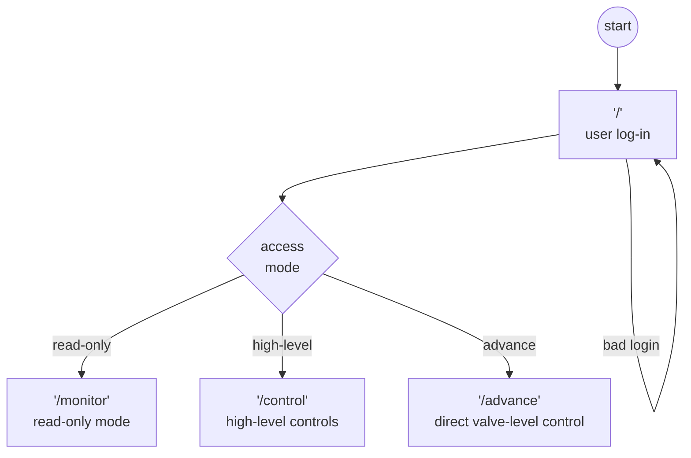

# Modbus TCP Client
## Description
The Modbus TCP client monitors the state of a <abbr title="Programmable Logic Controller">PLC</abbr> and presenting that state through a Flask Web server.
---

## Table of Contents
- [Description](#description)
- [Design](#design)
---

## Design
The application was built as a Web application using [Python](https://www.python.org/) and
[Flask](https://flask.palletsprojects.com/en/2.2.x/). The application communicates with the
<abbr>PLC</abbr> using [pyModbus](https://pymodbus.readthedocs.io/) stack. The application has five routes which align with the access modes, plus log-on, as depicted below:

